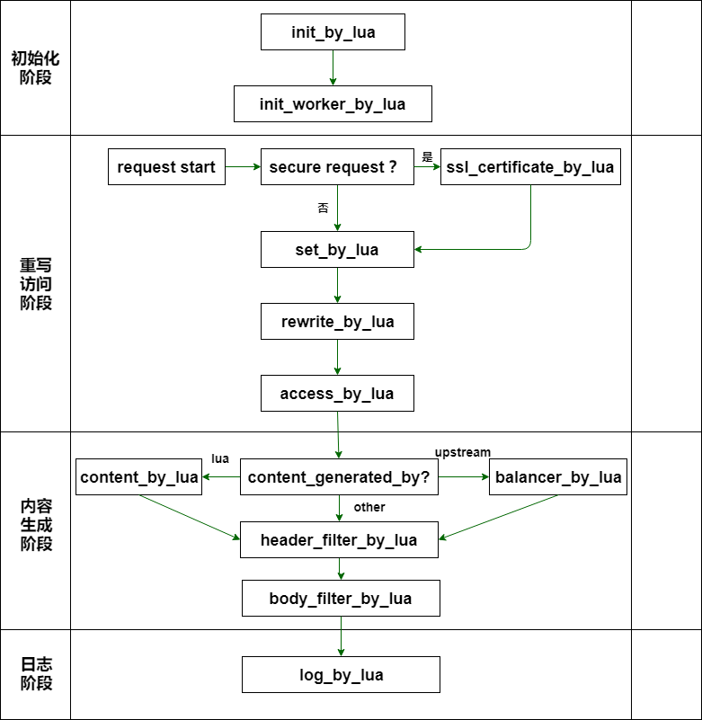

# OpenResty 基础入门

## 一、OpenResty 介绍

### 1.OpenResty 是什么

[OpenResty](https://openresty.org/cn/) 是基于 Nginx 的全功能 Web 应用服务器，集成了大量的高质量第三方模块，扩展了 Nginx 的功能。它支持使用 Lua 编写 Nginx 的配置文件，可以在 Nginx 中直接嵌入 Lua 代码，实现更灵活和高效的功能扩展。OpenResty 不仅适用于构建高性能的 Web 服务器，还可以作为 API 网关、反向代理、缓存服务器等多种用途。

目前国内有淘宝网，58 同城，美团，京东，知乎等一些网络平台都是使用的 openresty,业务场景方面如 WAF,CDN 调度等都在使用 openresty，cloudflare 公司以前使用的就是 openresty,不过目前 cloudflare 由于一些自身原因，已经开始构建自己的网络代理框架 Pingora

### 2. OpenResty 的优点、适用场景以及不足之处

1. 优点：

   - 高性能：
     OpenResty 基于 Nginx，具有优秀的性能表现，能够处理高并发请求，适用于对性能要求较高的场景。

   - 灵活的扩展性：
     OpenResty 使用 Lua 编程语言，可以灵活定制和扩展各种功能，如自定义路由、访问控制、请求转发等，适用于需要定制化处理逻辑的场景。


   - 易于部署和管理：
     OpenResty 的部署和管理相对简单，可以快速搭建起一个高性能的 Web 服务环境，适用于快速迭代和开发的场景。

2. 适用场景：

   - API 网关：
     OpenResty 可以作为 API 网关，用于管理和控制 API 的访问，包括路由、认证、限流、监控等功能。

   - 反向代理：
     OpenResty 可以作为反向代理，用于负载均衡、请求转发和缓存处理，适用于构建高可用性和高性能的 Web 服务集群。

   - 微服务架构：
     OpenResty 可以与微服务架构结合，用于管理和调度微服务之间的通信，包括路由、负载均衡、安全认证等功能。

3. 不足之处：

   - 学习曲线：
     OpenResty 使用 Lua 编程，需要一定的学习成本，对于不熟悉 Lua 的开发者来说可能需要一段时间适应。

   - 生态相对局限：
     相比一些大型 API 网关平台如 Spring Cloud Gateway，OpenResty 的生态相对较小，可能缺少一些成熟的解决方案和插件支持。如认证授权插件，限流和熔断插件，监控和分析插件

   - 对运维人员技能要求较高：
     OpenResty 的配置和调优需要一定的运维经验和技能，对于没有相关经验的团队可能需要进行培训和学习。

## 二、 Nginx 的基本使用

### 1. Nginx 安装

```shell
wget https://nginx.org/download/nginx-1.25.5.tar.gz

tar -zxvf nginx-1.25.5.tar.gz

./configure --prefix=/usr/local/nginx \ #安装路径

make & make install
```

### 2. Nginx 命令及信号控制

#### a. Nginx 命令参数

```shell
# nginx -h
nginx version: nginx/1.25.5
Usage: nginx [-?hvVtTq] [-s signal] [-p prefix]
             [-e filename] [-c filename] [-g directives]

Options:
  #显示帮助信息并退出。这两个选项都是用于查看帮助文档。
  -?,-h         : this help

  #显示 Nginx 的版本信息并退出。
  -v            : show version and exit

  #显示 Nginx 的版本信息和配置选项，然后退出。这会列出编译 Nginx 时所用的所有配置参数。
  -V            : show version and configure options then exit

  #测试配置文件的语法是否正确，然后退出。不启动服务器。
  -t            : test configuration and exit

  #测试配置文件的语法是否正确，并输出配置文件的内容，然后退出。
  -T            : test configuration, dump it and exit

   #在测试配置文件时，抑制非错误信息的输出。
  -q            : suppress non-error messages during configuration testing

  #向主进程发送信号。可以使用的信号包括 stop：快速停止 Nginx，不等待当前连接处理完成。
  #stop：快速停止 Nginx，不等待当前连接处理完成。
  #quit：优雅地停止 Nginx，等待当前连接处理完成。
  #reopen：重新打开日志文件。
  #reload：重新加载配置文件。
  -s signal     : send signal to a master process: stop, quit, reopen, reload

  #设置 Nginx 的前缀路径（默认路径是 /usr/local/nginx/）。前缀路径指的是 Nginx 安装的位置，这个选项用于覆盖默认的安装路径。
  -p prefix     : set prefix path (default: /usr/local/nginx/)

  #设置错误日志文件（默认是 logs/error.log）。这个选项允许指定一个自定义的错误日志文件路径。
  -e filename   : set error log file (default: logs/error.log)

  #设置配置文件路径（默认是 conf/nginx.conf）。可以通过这个选项指定一个不同于默认位置的配置文件。
  -c filename   : set configuration file (default: conf/nginx.conf)

  #设置全局指令，这些指令会覆盖配置文件中的全局指令。例如，可以用 -g "daemon off;" 来临时禁用守护进程模式。
  -g directives : set global directives out of configuration file
```

#### b. 信号控制

[Controlling nginx](https://nginx.org/en/docs/control.html)

Nginx 支持 2 种进程模型 single 和 master-worker

- Single 模式：单个进程处理所有请求，这种模式通常用于调试和开发环境，因为它不能充分利用多核 CPU 的优势，也没有故障隔离的能力。一般生产环境中不推荐使用这种模式。

- Master-Worker 模式：这是 Nginx 的默认工作模式，也是生产环境中推荐使用的模式。它包含一个主进程和多个工作进程。主进程负责管理工作进程，工作进程处理实际的客户端请求。
  读取和验证配置文件。
  Master: 管理工作进程的启动、停止和重启。管理与操作系统的交互，如处理信号
  Worker: 处理实际的客户端请求。每个工作进程都是独立的，相互之间没有共享内存（除了共享内存区域如缓存等），这提高了稳定性和安全性。

信号类型

INT，TERM 快速关闭信号 首先会关闭监听端口，停止接收新的连接，然后把当前正在处理的连接全部处理完，最后再退出进程。
QUIT 从容关闭信号
HUP 从容重启信号，一般用于修改配置文件后，使用新配置启动新的工作进程、优雅关闭旧的工作进程
USR1 重读日志，一般用于日志的切割
USR2 平滑升级信号
WINCH 从容关闭旧进程

1. 快速关闭 nginx
   kill -TERM master 进程号
   kill -INT master 进程号
   pkill -9 nginx 可以根据进程的名称或其他属性选择要终止的进程。

2. 重启 Nginx
   kill -HUP master 进程号

3. 日志切割
   kill -USR1 master 进程号

   ```shell
   #!/bin/bash
   LOGS_PATH=/usr/local/nginx/logs
   YESTERDAY=$(date -d "yesterday" +%Y-%m-%d)
   mv ${LOGS_PATH}/access.log ${LOGS_PATH}/access_${YESTERDAY}.log
   kill -USR1 $(cat /usr/local/nginx/logs/nginx.pid)   # 向 Nginx 主进程发送 USR1 信号。USR1 信号是重新打开日志文件
   ```

   设置定时任务
   #vim /etc/crontab
   0 0 \* \* \* root /usr/local/nginx/logs/cutlog.sh
   表示配置一个定时任务，定时每天 00:00 以 root 身份执行脚本/usr/local/nginx/logs/cutlog.sh，实现定时自动分割 Nginx 日志

4. 平滑升级
   a. make 平滑升级

   ```shell
   mv /usr/local/nginx/sbin/nginx /usr/local/nginx/sbin/nginx.old
   cp -f objs/nginx /usr /local/nginx
   make upgrade
   make clean
   ```

   b. 信号平滑升级

   1). kill -USR2 cat /usr/local/nginx/logs/nginx.pid 更新配置文件
   给 nginx 发送 USR2 信号后，nginx 会将 logs/nginx.pid 文件重命名为 nginx.pid.oldbin，然后用新的可执行文件启动一个新的 nginx 主进程和对应的工作进程，并新建一个新的 nginx.pid 保存新的主进程号

   2).kill -WINCH 旧的主进程号
   旧的主进程号收到 WINCH 信号后，将旧进程号管理的旧的工作进程优雅的关闭。即一段时间后旧的工作进程全部关闭，只有新的工作进程在处理请求连接。这时，依然可以恢复到旧的进程服务，因为旧的进程的监听 socket 还未停止。处理完后，工作进程会自动关闭

   3). kill -QUIT cat /usr/local/nginx/logs/nginx.pid.oldbin 优雅的关闭
   给旧的主进程发送 QUIT 信号后，旧的主进程退出，并移除 logs/nginx.pid.oldbin 文件，nginx 的升级完成。中途停止升级，回滚到旧 的 nginx

   4). 在步骤(2)时，如果想回到旧的 nginx 不再升级
   给旧的主进程号发送 HUP 命令，此时 nginx 不重新读取配置文件的情况下重新启动旧主进程的工作进程。
   kill -HUP 9944 --旧主进程号 重启工作进程
   kill -QUIT 10012 --新主进程号

### 3. Nginx 配置文件说明

```nginx
#以哪个用户，运行nginx应用，nobody是个低权限用户
#user  nobody;

#nginx进程数 启动进程,通常设置成 cpu的核数
#查看cpu核数
# cat /proc/cpuinfo
worker_processes  1;

#全局错误日志
#nginx的error_log类型如下（从左到右：debug最详细 crit最少）：
#[ debug | info | notice | warn | error | crit ]
#例如：error_log logs/nginx_error.log  crit;
#解释：日志文件存储在nginx安装目录下的 logs/nginx_error.log ，错误类型为 crit ，也就是记录最少错误信息；
#error_log  logs/error.log;
#error_log  logs/error.log  notice;
#error_log  logs/error.log  info;

#PID文件，记录当前启动的nginx的进程ID
#pid        logs/nginx.pid;

#这个参数表示worker进程最多能打开的文件句柄数，基于liunx系统ulimit设置
#查看系统文件句柄数最大值：ulimit -n
#Linux一切皆文件，所有请求过来最终目的访问文件，所以该参数值设置等同于liunx系统ulimit设置为优
#可以通过linux命令设置  最大的文件句柄数65535

worker_rlimit_nofile 1024;

#工作模式及连接数上限
https://nginx.org/en/docs/events.html
worker_processes  1;
events {
   #网络模型高效(相当于建立索引查找结果)，nginx配置应该启用该参数
   #但是仅用于linux2.6以上内核,可以大大提高nginx的性能
   use   epoll;
   #该参数表示设置一个worker进程最多开启多少线程数
   #优化设置应该等同于worker_rlimit_nofile设置值，表明一个线程处理一个http请求，同时可以处理一个文件数，各个模块之间协调合作不等待。
   worker_connections  1024;
}

#设定http服务器，利用它的反向代理功能提供负载均衡支持
http {

    #设定mime类型,类型由mime.type文件定义
    #MIME(Multipurpose Internet Mail Extensions)多用途互联网邮件扩展类型。是设定某种扩展名的文件用一种应用程序来#打开的方式类型，当该扩展名文件被访问的时候，浏览器会自动使用指定应用程序来打开
    include       mime.types;
    default_type  application/octet-stream;

    #设定日志格式
    log_format  main  '[$remote_addr] - [$remote_user] [$time_local] "$request" '
                      '$status $body_bytes_sent "$http_referer" '
                      '"$http_user_agent" "$http_x_forwarded_for"';
    access_log    /var/log/nginx/access.log;

    #sendfile 开启高效文件传输模式，sendfile指令指定nginx是否调用sendfile函数来输出文件，对于普通应用设为 on，如果用来进行下载等应用磁盘IO重负载应用，可设置为off，以平衡磁盘与网络I/O处理速度，降低系统的负载。注意：如果图片显示不正常把这个改成off。
    sendfile        on;
    #防止网络阻塞 tcp_nopush 通常用于提高网络传输的效率，特别是在发送短数据包时。它的作用是将 TCP 数据发送缓冲区中的数据立即发送给对端，而不等待填充满整个 TCP 包。当应用程序需要发送一小部分数据，而且不希望等待 TCP 包被填充满时，启用 tcp_nopush 可以避免等待缓冲区填充满而引起的延迟。
    tcp_nopush     on;
    #防止网络阻塞 tcp_nodelay 则是用于禁用 Nagle 算法，它允许在数据包未确认之前发送新的数据包。Nagle 算法的目的是减少网络中的小分组数量，从而减少网络拥塞，但这会引入一定的延迟。禁用 tcp_nodelay 可以降低数据传输的延迟，特别是对于一些对实时性要求较高的应用，如在线游戏、视频流媒体等。
    tcp_nodelay        on;

    #将 keepalive_timeout 设置为 0 的含义是让服务器立即关闭空闲连接，而不管连接是否处于空闲状态。这意味着每个连接在完成请求之后立即关闭，不会保持持久连接的状态。
    #keepalive_timeout  0;
    keepalive_timeout  65;

    #开启gzip压缩
    gzip  on;
    gzip_disable "MSIE [1-6]\."; # IE6及以下禁止压缩
    gzip_min_length 1k; #最小压缩文件大小
    gzip_buffers 4 16k; #压缩缓冲区
    gzip_http_version 1.0; #压缩版本（默认1.1，前端如果是squid2.5请使用1.0）
    gzip_comp_level 2; #压缩等级
    gzip_types text/plain application/x-javascript text/css application/xml; #压缩类型
    gzip_vary on; #给CDN和代理服务器使用，针对相同url，可以根据头信息返回压缩和非压缩副本

    #设定请求缓冲
    client_header_buffer_size    1k;   #上传文件大小限制
    large_client_header_buffers  4 4k;  #设定请求缓存

    #设定负载均衡的服务器列表
    # least_conn，ip_hash， least_time header;
    # Sticky 会话 nginx-sticky-module-ng https://github.com/bymaximus/nginx-sticky-module-ng
    upstream mysvr {
        #weigth参数表示权值，权值越高被分配到的几率越大
        server 192.168.8.1x:3128 weight=5;
        server 192.168.8.2x:80  weight=1;
        server 192.168.8.3x:80  weight=6;
    }

    upstream stickySvr {
      #设置 Sticky 负载均衡的 Cookie 名称为 my_session_id 的有效期为 1 小时，适用于 .example.com 域名下的所有路径。
      sticky cookie my_session_id expires=1h domain=.example.com path=/;
      server backend1.example.com:8080;
      server backend2.example.com:8080;
      server backend3.example.com:8080;
    }

    server {
           #侦听80端口 reuseport 选项常用于高并发、大流量的 Web 服务器配置中，尤其是在多核服务器环境下，可以显著提升 Nginx 的性能和资源利用率。通过允许多个工作进程同时监听同一端口，Nginx 可以更高效地处理大量并发连接，从而提高整体的服务响应能力,Linux 内核 3.9 及以上版本支持这一选项。
           # 探索惊群 https://wenfh2020.com/2021/09/25/thundering-herd/
            listen       80  reuseport;
            #设置编码
            #charset koi8-r;

            #定义使用www.xx.com访问 域名可以有多个，用空格隔开
            server_name  www.xx.com;

            #设定本虚拟主机的访问日志 main指定上面定义的日志格式
            access_log  logs/www.xx.com.access.log  main;

         #默认请求
        location / {
              root   /root;      #定义服务器的默认网站根目录位置
              index index.php index.html index.htm;   #定义首页索引文件的名称


              proxy_pass  http://mysvr ;#请求转向mysvr 定义的服务器列表

              client_max_body_size 10m;    #允许客户端请求的最大单文件字节数
              client_body_buffer_size 128k;  #缓冲区代理缓冲用户端请求的最大字节数，

              #以下是一些反向代理的配置可删除.
              proxy_redirect off;

              #后端的Web服务器可以通过X-Forwarded-For获取用户真实IP
              proxy_set_header Host $host;
              proxy_set_header X-Real-IP $remote_addr;
              proxy_set_header X-Forwarded-For $proxy_add_x_forwarded_for;
              proxy_connect_timeout 90;                                     #nginx跟后端服务器连接超时时间(代理连接超时)
              proxy_send_timeout 90;                                        #后端服务器数据回传时间(代理发送超时)
              proxy_read_timeout 90;                                        #连接成功后，后端服务器响应时间(代理接收超时)
              proxy_buffer_size 4k;                                         #设置代理服务器（nginx）保存用户头信息的缓冲区大小
              proxy_buffers 4 32k;                                          #proxy_buffers缓冲区，网页平均在32k以下的话，这样设置
              proxy_busy_buffers_size 64k;                                  #高负荷下缓冲大小（proxy_buffers*2）
              proxy_temp_file_write_size 64k;                               #设定缓存文件夹大小，大于这个值，将从upstream服务器传

        }


        # 定义错误提示页面
        error_page   500 502 503 504 /50x.html;
        location = /50x.html {
            root   /root;
        }

        #静态文件，nginx自己处理
        location ~ ^/(images|javascript|js|css|flash|media|static)/ {
            root /var/www/virtual/htdocs;
            #过期30天，静态文件不怎么更新，过期可以设大一点，如果频繁更新，则可以设置得小一点。
            expires 30d;
        }

        #设定查看Nginx状态的地址
        location /NginxStatus {
            stub_status            on;
            access_log              on;
            auth_basic              "NginxStatus";
            auth_basic_user_file  conf/htpasswd;
            #htpasswd文件的内容可以用apache提供的htpasswd工具来产生。
        }

        #error_page  404              /404.html;

        # redirect server error pages to the static page /50x.html
        #
        error_page   500 502 503 504  /50x.html;
        location = /50x.html {
            root   html;
        }

        # proxy the PHP scripts to Apache listening on 127.0.0.1:80
        #
        #location ~ \.php$ {
        #    proxy_pass   http://127.0.0.1;
        #}

        # pass the PHP scripts to FastCGI server listening on 127.0.0.1:9000
        #
        #location ~ \.php$ {
        #    root           html;
        #    fastcgi_pass   127.0.0.1:9000;
        #    fastcgi_index  index.php;
        #    fastcgi_param  SCRIPT_FILENAME  /scripts$fastcgi_script_name;
        #    include        fastcgi_params;
        #}

        # deny access to .htaccess files, if Apache's document root
        # concurs with nginx's one
        #
        #location ~ /\.ht {
        #    deny  all;
        #}
    }


    # another virtual host using mix of IP-, name-, and port-based configuration
    #
    #server {
    #    listen       8000;
    #    listen       somename:8080;
    #    server_name  somename  alias  another.alias;

    #    location / {
    #        root   html;
    #        index  index.html index.htm;
    #    }
    #}


    # HTTPS server
    #
    #server {
    #    listen       443 ssl;
    #    server_name  localhost;

    #    ssl_certificate      cert.pem;
    #    ssl_certificate_key  cert.key;

    #    ssl_session_cache    shared:SSL:1m;
    #    ssl_session_timeout  5m;

    #    ssl_ciphers  HIGH:!aNULL:!MD5;
    #    ssl_prefer_server_ciphers  on;

    #    location / {
    #        root   html;
    #        index  index.html index.htm;
    #    }
    #}

}
```

#### 1. worker_processes

表示开启 nginx 的 worker 进程的个数，nginx 启动会开两种进程，master 进程用来管理调度，worker 进程用来处理请求；

有两种设置方法

##### 方法一：worker_processes auto;

表示设置服务器 cpu 核数匹配开启 nginx 开启的 worker 进程数

查看 cpu 核数：cat /proc/cpuinfo

##### 方法二：nginx 设置 cpu 亲和力

worker_processes 8;

worker_cpu_affinity 00000001 00000010 00000100 00001000 00010000 00100000 01000000 10000000;

00000001 表示启用第一个 CPU 内核，00000010 表示启用第二个 CPU 内核，以此类推

worker_cpu_affinity：表示开启八个进程，第一个进程对应着第一个 CPU 内核，第二个进程对应着第二个 CPU 内核，以此类推。

这种设置方法更高效，因将每个 cpu 核提供给固定的 worker 进程服务，减少 cpu 上下文切换带来的资源浪费

如果服务器 cpu 有限
 比如：2 核 CPU，开启 2 个进程，设置如下
 worker_processes 2;
 worker_cpu_affinity 01 10;

比如：4 核 CPU,开启 4 个进程，设置如下
 worker_processes 4;
 worker_cpu_affinity 0001 0010 0100 1000;
 8 核 cpu ，worker_processes=8
 1 个 worker 进程 能够最大打开的文件数（线程数）worker_connections=65535 （参考 worker_rlimit_nofile ----> linux ulimit -n）
最大的客户端连接数 max_clients = （多少个工作进程数）worker_processes * （1 个工作线程的处理线程数）worker_connections 8*65535

nginx 作为 http 服务器
 请求模型 client <---> nginx
 max*clients = worker_processes * worker*connections/2
 nginx 作为反向代理服务器的时候
 请求模型 client <---> nginx <----> web server
 max_clients = worker_processes * worker_connections/4
 (
 为什么除以 2：该公式基于 http 1.1 协议，一次请求大多数浏览器发送两次连接，并不是 request 和 response 响应占用两个线程（很多人也是这么认为，实际情况：请求是双向的连接是没有方向的，由上面的图可以看出来)
 为什么除以 4：因 nginx 作为方向代理，客户端和 nginx 建立连接，nginx 和后端服务器也要建立连接
 )
 由此，我们可以计算 nginx 作为 http 服务器最大并发量(作为反向代理服务器自己类推)，可以为压测和线上环境的优化提供一些理论依据：
 单位时间（keepalive_timeout）内 nginx 最大并发量 C
 C=worker_processes * worker_connections/2=8*65535/2
 而每秒的并发量 CS
 CS=worker_processes * worker_connections/(2*average_request_time) 由于 keepalive_timeout 设置的时间决定了一个连接在保持活动状态的时间长度，所以这里使用 65

#### nginx 内置参数

[Alphabetical index of variables (nginx.org)](https://nginx.org/en/docs/varindex.html)

```nginx
$arg_name 请求中的name参数
$args 请求中的参数
$http_host               请求地址，即浏览器中你输入的地址（IP或域名）     www.wang.com 192.168.100.100
$time_local              访问时间和时区                                18/Jul/2012:17:00:01 +0800
$binary_remote_addr 远程地址的二进制表示
$body_bytes_sent  已发送的消息体字节数
$content_length HTTP请求信息里的"Content-Length"
$content_type 请求信息里的"Content-Type"
$document_root  针对当前请求的根路径设置值
$document_uri 与$uri相同; 比如 /test2/test.php
$host 请求信息中的"Host"，如果请求中没有Host行，则等于设置的服务器名
$hostname 机器名使用 gethostname系统调用的值
$http_cookie  cookie 信息
$http_referer 引用地址
$http_user_agent  客户端代理信息
$http_via 最后一个访问服务器的Ip地址。
$http_x_forwarded_for 相当于网络访问路径
$proxy_add_x_forwarded_for 该变量是 $remote_addr 和 $http_x_forwarded_for 的组合。
$is_args  如果请求行带有参数，返回“?”，否则返回空字符串
$limit_rate 对连接速率的限制
$nginx_version  当前运行的nginx版本号
$pid  worker进程的PID
$query_string 与$args相同
$realpath_root  按root指令或alias指令算出的当前请求的绝对路径。其中的符号链接都会解析成真是文件路径
$remote_addr  客户端IP地址
$remote_port  客户端端口号
$remote_user  客户端用户名，认证用
$request  用户请求
$request_body 这个变量（0.7.58+）包含请求的主要信息。在使用proxy_pass或fastcgi_pass指令的location中比较有意义
$request_body_file  客户端请求主体信息的临时文件名
$request_completion 如果请求成功，设为"OK"；如果请求未完成或者不是一系列请求中最后一部分则设为空
$request_filename 当前请求的文件路径名，比如/opt/nginx/www/test.php
$request_method 请求的方法，比如"GET"、"POST"等
$request_uri  请求的URI，带参数; 比如http://localhost:88/test1/
$scheme 所用的协议，比如http或者是https
$server_addr  服务器地址，如果没有用listen指明服务器地址，使用这个变量将发起一次系统调用以取得地址(造成资源浪费)
$server_name  请求到达的服务器名
$server_port  请求到达的服务器端口号
$server_protocol  请求的协议版本，"HTTP/1.0"或"HTTP/1.1"
$uri  请求的URI，可能和最初的值有不同，比如经过重定向之类的
$upstream_response_time  请求过程中，upstream响应时间                    0.002
$request_time            整个请求的总时间                               0.205
$upstream_addr           后台upstream的地址，即真正提供服务的主机地址     10.10.10.100:80
$ssl_cipher              交换数据中的算法                               RC4-SHA
$ssl_protocol            SSL协议版本                                   TLSv1
$upstream_status         upstream状态                                  200
```

### 4. Nginx 模块安装

```shell
wget https://github.com/openresty/echo-nginx-module/archive/refs/tags/v0.63.tar.gz
./configure --prefix=/usr/local/nginx \ #安装路径
--add-moudle=/root/app/nginx-tool/echo-nginx-module #模块地址
worker_processes 1;
events {
    worker_connections 1024;
}

http {
    server {
        listen 8080 reuseport;

        location /hello {
            default_type text/plain;
            echo -n "hello, ";
            echo "world!";
        }

        location /print_vars {
            default_type text/plain;
            echo "args: $args";
            echo "content_length: $content_length";
            echo "content_type: $content_type";
            echo "body_bytes_sent: $body_bytes_sent";
            echo "document_root: $document_root";
            echo "document_uri: $document_uri";
            echo "host: $host";
            echo "hostname: $hostname";
            echo "http_cookie: $http_cookie";
            echo "http_referer: $http_referer";
            echo "http_user_agent: $http_user_agent";
            echo "http_via: $http_via";
            echo "http_x_forwarded_for: $http_x_forwarded_for";
            echo "is_args: $is_args";
            echo "limit_rate: $limit_rate";
            echo "nginx_version: $nginx_version";
            echo "pid: $pid";
            echo "query_string: $query_string";
            echo "realpath_root: $realpath_root";
            echo "remote_addr: $remote_addr";
            echo "remote_port: $remote_port";
            echo "remote_user: $remote_user";
            echo "request: $request";
            echo "request_body: $request_body"; # 注意：这可能不安全或不可靠，除非你知道请求体的大小并已配置好读取
            echo "request_completion: $request_completion";
            echo "request_filename: $request_filename";
            echo "request_method: $request_method";
            echo "request_uri: $request_uri";
            echo "scheme: $scheme";
            echo "server_addr: $server_addr";
            echo "server_name: $server_name";
            echo "server_port: $server_port";
            echo "server_protocol: $server_protocol";
            echo "uri: $uri";
        }
    }
}

nginx -p $PWD
```

## 三、OpenResty 入门

### 1. OpenResty 安装以及基本使用

[OpenResty - OpenResty® Linux 包](https://openresty.org/cn/linux-packages.html#debian)

debian 上安装：

```shell
步骤一：安装导入 GPG 公钥时所需的几个依赖包（整个安装过程完成后可以随时删除它们）：
sudo apt-get -y install --no-install-recommends wget gnupg ca-certificates

步骤二：导入我们的 GPG 密钥：
debian <= 11 的版本
wget -O - https://openresty.org/package/pubkey.gpg | sudo apt-key add -
debian >= 12 的版本
wget -O - https://openresty.org/package/pubkey.gpg | sudo gpg --dearmor -o /etc/apt/trusted.gpg.d/openresty.gpg

步骤三：添加官方 APT 仓库。
对于 x86_64 或 amd64 系统，可以使用下面的命令：
codename=`grep -Po 'VERSION="[0-9]+ \(\K[^)]+' /etc/os-release`
echo "deb http://openresty.org/package/debian $codename openresty" \
    | sudo tee /etc/apt/sources.list.d/openresty.list
而对于 arm64 或 aarch64 系统，则可以使用下面的命令:
codename=`grep -Po 'VERSION="[0-9]+ \(\K[^)]+' /etc/os-release`

echo "deb http://openresty.org/package/arm64/debian $codename openresty" \
    | sudo tee /etc/apt/sources.list.d/openresty.list

步骤四：更新 APT 索引：
sudo apt-get update

sudo apt-get -y install openresty
```

#### 1. hello world

```nginx
location = /hello {
    default_type application/octet-stream;
    content_by_lua_block {
        for i = 1, 4 do
        ngx.say("hello world", i)
        ngx.flush(true)
        ngx.sleep(1) -- sec
        end
    }
}
```

##### a. 预编译 lua 模块到 LuaJit 字节码加快 OpenResty 启动速度

```shell
-- 加载模块和原始开销时间
time resty -I. -e 'require "large_test"'
-- 原始开销
time resty -e ''
-- 编译luajit字节码
time /usr/local/openresty/luajit/bin/luajit -bg lua/large_test.lua lua/large_test.ljbc
```

##### b. 使用 restydoc 查看 OpenResty 文档

```shell
which restydoc
apt-get install openresty-restydoc
restydoc -s rewrite
```

##### c. 跨请求共享数据

lua/count.lua

```lua
local _M = {}
local counter = 0

function _M.luacache()
    counter = counter + 1
    return counter
end

return _M
```

nginx.conf

```nginx
lua_code_cache on | off #开启关闭lua缓存, 默认是开
lua_shared_dict dictCount 1m;

location /shareVar {
  default_type text/plain;
  content_by_lua_block {
    local mod = require "count"
    local cnt = mod.luacache()
    ngx.say("lua cache counter = ", cnt)

    local dictCount = ngx.shared.dictCount
    local shareCount = dictCount:get("shareCounter")

    if shareCount then
      dictCount:incr("shareCounter", 1)
      shareCount = dictCount:get("shareCounter") -- 更新后的值
    else
      dictCount:set("shareCounter", 1)
      shareCount = 1 -- 初始值
    end

    ngx.say("dict cache counter = ", shareCount)
  }
}
curl 'http://127.0.0.1:8080/shareVar'

# Ilua 添加了 lua 目录到 Lua 的模块搜索路径
resty -Ilua -e 'require "count" print(package.loaded["count"].main)'
# 遍历并打印出当前 Lua 环境中已经加载的所有模块的名称。
resty -e 'for k, v in pairs(package.loaded) do print(k) end'

# 当前缓存是每个工作线程中的，如果需要全局共享则要使用
lua_shared_dict
ngx.shared.DICT
```

ngx.shared.DICT 使用方法可以使用

```shell
restydoc -s ngx.shared.DICT
```

进行查看

### 2. OpenResty 中的 Lua

#### 1. OpenResty 引入 Lua 的方式

```nginx
user chaos;
worker_processes 1;
events {
    worker_connections 1024;
}

http {
    server {
        listen 8080 reuseport;

        location /testlua {
            content_by_lua "ngx.say('content_by_lua')";
        }

        location /testLuaContent {
            default_type text/plain;
            content_by_lua_block {
                ngx.say("content_by_lua_block")
            }
        }

        location /testLuaFile {
            default_type text/plain;
            content_by_lua_file lua/test.lua;
        }
    }
}

lua_code_cache on | off
# 适用上下文：http、server、location、location if
```

test.lua 文件

```lua
ngx.say("content by lua file");
```

#### 2. OpenResty 中 Lua 常用的 api

##### a. ngx.var 获取 Nginx 变量和内置变量

```nginx
# http://localhost:8080/var?a=1&b=2
location /var {
  set $c 3;
  default_type text/plain;
  content_by_lua_block {
        local a = tonumber(ngx.var.arg_a) or 0
        local b = tonumber(ngx.var.arg_b) or 0
        local c = tonumber(ngx.var.c) or 0
        ngx.say("sum:", a + b + c )
        return ngx.exit(ngx.HTTP_OK)
    }
}

# 对于nginx location中使用正则捕获的捕获组可以使用ngx.var[捕获组数字]获取；
#  http://localhost:8080/var?a=111
location ~ ^/var/([0-9]+) {
  content_by_lua_block {
      ngx.say("var[1]:", ngx.var[1] )
  }
}
```

##### b. ngx.req 获取请求头和请求参数

```lua
--获取请求头
ngx.header.content_type = "text/plain; charset=utf-8"
local headers = ngx.req.get_headers()
ngx.say("============headers begin===============")
ngx.say("Host : ", headers["Host"])
ngx.say("headers['user-agent'] : ", headers["user-agent"])
ngx.say("headers.user_agent : ", headers.user_agent )
ngx.say("-------------遍历headers-----------")
for k,v in pairs(headers) do
    if type(v) == "table" then
        ngx.say(k, " : ", table.concat(v, ","))
    else
        ngx.say(k, " : ", v)
    end
end
ngx.say("===========headers end============")
ngx.say()

--get请求uri参数
ngx.say("===========uri get args begin==================")
local uri_args = ngx.req.get_uri_args()
for k, v in pairs(uri_args) do
    if type(v) == "table" then
        ngx.say(k, " : ", table.concat(v, ", "))
    else
        ngx.say(k, ": ", v)
    end
end
ngx.say("===========uri get args end==================")

--post请求参数
-- ngx.req.get_post_args：获取post请求内容体，其用法和get_headers类似，但是必须提前调用ngx.req.read_body()来读取body体
ngx.req.read_body()
ngx.say("=================post args begin====================")
local post_args = ngx.req.get_post_args()
for k, v in pairs(post_args) do
    if type(v) == "table" then
        ngx.say(k, " : ", table.concat(v, ", "))
    else
        ngx.say(k, ": ", v)
    end
end
ngx.say("================post args end=====================")

--请求的http协议版本
ngx.say("ngx.req.http_version : ", ngx.req.http_version())
--请求方法
ngx.say("ngx.req.get_method : ", ngx.req.get_method())
--原始的请求头内容
ngx.say("ngx.req.raw_header : ",  ngx.req.raw_header())
--请求的body内容体
ngx.say("ngx.req.get_body_data() : ", ngx.req.get_body_data())

ngx.req.raw_header()这个函数返回值为字符串
```

##### c. 编码解码

```lua
ngx.escape_uri/ngx.unescape_uri ： uri编码解码；
ngx.encode_args/ngx.decode_args：参数编码解码；
ngx.encode_base64/ngx.decode_base64：BASE64编码解码；

-- http://localhost:8080/encode?userId=1&a=2&c=3
--未经解码的请求uri
local request_uri = ngx.var.request_uri;
ngx.say("request_uri : ", request_uri);

--编码
local escape_uri = ngx.escape_uri(request_uri)
ngx.say("escape_uri : ", escape_uri);

--解码
ngx.say("decode request_uri : ", ngx.unescape_uri(escape_uri));

--参数编码
local request_uri = ngx.var.request_uri;
local question_pos, _ = string.find(request_uri, '?')
if question_pos>0 then
  local uri = string.sub(request_uri, 1, question_pos-1)
  ngx.say("uri sub=",string.sub(request_uri, question_pos+1));

  --对字符串进行解码
  local args = ngx.decode_args(string.sub(request_uri, question_pos+1))

  for k,v in pairs(args) do
    ngx.say("k=",k,",v=", v);
  end

  if args and args.userId then
    args.userId = args.userId + 10000
    ngx.say("args+10000 : ", uri .. '?' .. ngx.encode_args(args));
  end
end
```

##### d. ngx.ctx 全局共享变量

由于 OpenResty 中有不同的处理阶段，如果需要在不同的处理阶段中进行数据共享，就可以使用 ngx.ctx

```nginx
location /share_var {
     rewrite_by_lua_block {
         ngx.ctx.value = 5
     }
     access_by_lua_block {
         ngx.ctx.value = ngx.ctx.value + 10
     }
     content_by_lua_block {
         ngx.say(ngx.ctx.value)
     }
 }

```

每个请求都有自己的一份 ngx.ctx 表，子请求也是有自己独立的一份

```nginx
location /son {
    content_by_lua_block {
        ngx.say("is subrequest: ",ngx.is_subrequest)
        ngx.say("son pre: ", ngx.ctx.count)
        ngx.ctx.count = 5
        ngx.say("son post: ", ngx.ctx.count)
    }
}

location /father {
    content_by_lua_block {
        ngx.ctx.count = 10
        ngx.say("father pre: ", ngx.ctx.count)
        local res = ngx.location.capture("/son")
        ngx.print(res.body)
        ngx.say("father post: ", ngx.ctx.count)
    }
}
```

##### e. 其他

```lua
ngx.md5("123") --md5加密

ngx.time()  --返回秒级精度的时间戳
ngx.now()   --返回毫秒级精度的时间戳
ngx.update_time()  -- 由于nginx的时间戳有换所以会造成不同时间调用方法返回的时间相同，如果需要更新缓存需要调用

-- 正则表达式相关
ngx.re.match
ngx.re.sub
ngx.re.gsub
ngx.re.find
ngx.re.gmatch

-- http://localhost:8080/regex
-- ngx.re.match示例
local m, err = ngx.re.match("hello, 9527", "[0-9]+")
if m then
  ngx.say(m[0])
else
  if err then
    ngx.log(ngx.ERR, "error: ", err)
    return
  end
  ngx.say("match not found")
end

local m, err = ngx.re.match("hello, 9527", "([0-9])[0-9]+")
ngx.say(m[0])
ngx.say(m[1])

-- 日志输出
ngx.log(log_level, ...)
ngx.STDERR     -- 标准输出
ngx.EMERG      -- 紧急报错
ngx.ALERT      -- 报警
ngx.CRIT       -- 严重，系统故障，触发运维告警系统
ngx.ERR        -- 错误，业务不可恢复性错误
ngx.WARN       -- 告警，业务中可忽略错误
ngx.NOTICE     -- 提醒，业务比较重要信息
ngx.INFO       -- 信息，业务琐碎日志信息，包含不同情况判断等
ngx.DEBUG      -- 调试

-- 请求重定向
ngx.redirect

location = /target {
  content_by_lua_block {
    ngx.say('I am bar')
  }
}

location = /from {
  rewrite_by_lua_block {
    return ngx.redirect('/target');
  }
}
```

### 3. OpenResty 中的模块使用

#### 1. Json 模块的使用

```lua
-- local json = require("cjson")
local json = require("cjson.safe")

-- table包含哈希键值对时，数组键值将被转换为字符串键值
local data = {1,2,name="chaos",age = 30,sex =man,hobby = {"basketball","football"}};
ngx.say(json.encode(data));

-- table所有键为数组型键值对时，会当作数组看待，空位将转化为null
local data1 = {[1]= 'a',[4]= 'b'};
ngx.say(json.encode(data1));


local jsonStr = [[ {"1":1,"2":2,"name":"chaos","hobby":["basketball","football"],"age":30}]];
local obj = json.decode(jsonStr)
ngx.say(" obj type: ", type(obj))

local jsonStr1 = [[ {"name":"chaos","money": null} ]];
local obj1 = json.decode(jsonStr1);
ngx.say(obj1.name);
ngx.say(obj1.money);

--[[
使用pcall 命令
pcall 接收一个函数和需要传递后者的参数，并执行，如果执行成功返回true，否则返回false，errorinfo
pcall 以一种"保护模式"来调用第一个参数（函数），因此 pcall 可以捕获函数执行中的任何错误。
]]--
function json_decode(str)
    -- local status, result = pcall(_json_decode, str);
    local status, result = pcall(json.decode, str);
    if status then
        return result;
    else
        return nil;
    end
end

local str = [[ {"key":value} ]]
--local obj2 = json_decode(str);
local obj2 = json.decode(str);
ngx.say(type(obj2));

ngx.say("empty json type: ", json.encode({}));
json.encode_empty_table_as_object(false);
ngx.say("empty json type: ", json.encode({}));
```

#### 2. redis 模块的使用

```lua
-- 引入模块
local redis = require "resty.redis"

-- Create a Redis instance
local red = redis:new()

-- Close redis connect
local function close_redis(red)
    if not red then
        return
    end
    -- put it into the connection pool of size 100,
    -- with 10 seconds max idle time
    local ok, err = red:set_keepalive(10000, 100)
    if not ok then
        ngx.log(ngx.ERR, "Failed to set keepalive: ", err)
        return
    end
end

-- Set the Redis server address and port
local redis_host = "192.168.71.110";
local redis_port = 6379;
local redis_password = [[123zxc\]];

-- Connect to the Redis server
local ok, err = red:connect(redis_host, redis_port)
if not ok then
    ngx.log(ngx.ERR, "Failed to connect to Redis: ", err)
    return
end

local times, err = red:get_reused_times()
if times == 0 then
    local ok, err = red:auth("default",redis_password)
    if not ok then
        ngx.log(ngx.ERR, "Failed to authenticate: ", err)
        return close_redis(red)
    end
elseif err then
    ngx.say("Failed to get reused times: ", err)
end

-- Set a key-value pair in Redis
local key = "mykey"
local value = "myvalue"
local res, err = red:set(key, value)
if not res then
    ngx.log(ngx.ERR, "Failed to set key-value pair in Redis: ", err)
    return close_redis(red)
end
ngx.say("Set key-value pair in Redis: ", res)

-- Get the value of a key from Redis
local res, err = red:get(key)
if not res then
    ngx.log(ngx.ERR, "Failed to get value from Redis: ", err);
    close_redis(red)
    return
end

-- Print the value
ngx.say("Value from Redis: ", res)

-- Close the Redis connection
close_redis(red)
```

#### 3. mysql 模块的使用

```lua
local mysql = require("resty.mysql")

-- Create a MySQL connection
local db, err = mysql:new()
if not db then
    ngx.log(ngx.ERR, "Failed to create MySQL object: ", err)
    return
end

-- Set the MySQL server address, port, and credentials
db:set_timeout(1000)  -- 1 second timeout
local ok, err, errno, sqlstate = db:connect{
    host = "192.168.71.110",
    port = 15003,
    database = "openresty",
    user = "root",
    password = "root",
    charset = "utf8mb4",
    max_packet_size = 1024 * 1024,
}

if not ok then
    ngx.log(ngx.ERR, "Failed to connect to MySQL: ", err, ": ", errno, " ", sqlstate)
    return
end
-- Get the current request URL and time
local request_url = ngx.var.http_host .. ngx.var.request_uri
local request_time = ngx.time()

-- 使用quote_sql_str去防止sql注入
local quote_sql_str = ngx.quote_sql_str
local request_url_escaped = quote_sql_str(request_url)
local request_time_escaped = quote_sql_str(tostring(request_time))

-- Example: Insert a new record with current request URL and time
local res, err, errno, sqlstate = db:query("INSERT INTO openresty_request (request_url, request_time) VALUES (" .. request_url_escaped .. ", FROM_UNIXTIME(" .. request_time_escaped .. "))")
if not res then
    ngx.log(ngx.ERR, "Failed to insert record: ", err, ": ", errno, " ", sqlstate)
    return
end

-- Example: Select records
local res, err, errno, sqlstate = db:query("SELECT * FROM openresty_request")
if not res then
    ngx.log(ngx.ERR, "Failed to select records: ", err, ": ", errno, " ", sqlstate)
    return
end

-- Process the selected records
for i, row in ipairs(res) do
    -- Access the columns using row.column_name
    -- ngx.log(ngx.INFO, "Record ", i, ": request_url=", row.request_url, ", request_time=", row.request_time)
    local row_str = "select row " .. i .. ": "
    local first = true
    for name, value in pairs(row) do
        if not first then
            row_str = row_str .. ", "
        end
        row_str = row_str .. name .. " = " .. value
        first = false
    end
    ngx.say(row_str)
end

-- Close the MySQL connection
local ok, err = db:set_keepalive(10000, 100)
if not ok then
    ngx.log(ngx.ERR, "Failed to set MySQL keepalive: ", err)
    return
end
```

#### 4. http 模块的使用

nginx 服务转发请求分为内部请求和外部请求

##### 1.内部请求

```lua
-- 单次请求
local res = ngx.location.capture(uri,{
    options？ -- options可以传参数和设置请求方式

});

-- 并发请求
res1,res2, ... = ngx.location.capture_multi({
      {uri, options?},
      {uri, options?},
      ...
})

res.status  --->保存子请求的响应状态码
res.header  --->用一个标准 Lua 表储子请求响应的所有头信息。如果是“多值”响应头，
            --->这些值将使用 Lua (数组) 表顺序存储。
res.body    --->保存子请求的响应体数据，它可能被截断。
                --->用户需要检测 res.truncated (截断) 布尔值标记来判断 res.body 是否包含截断的数据。
                --->这种数据截断的原因只可能是因为子请求发生了不可恢复的错误，
                --->例如远端在发送响应体时过早中断了连接，或子请求在接收远端响应体时超时。
res.truncated   --->是否截断

  location /userInfo {
      default_type text/plain;
      charset utf-8;

      content_by_lua_block {
          local res = ngx.location.capture("/adress");
          ngx.say(res.status)
          ngx.say(res.body)
      }
  }

  location /adress {
      internal; #阻止对外暴露，从浏览器直接进行请求时会报404
      default_type text/plain;
      charset utf-8;
      proxy_set_header Accept-Encoding ' ';
      content_by_lua_block {
          ngx.say("中国上海市浦东新区张江高科技园区")
      }
  }
```

##### 2. 外部请求

由于 OpenResty 默认不提供 http 客户端，需要使用第三方提供，这里可以使用 opm 进行添加安装

```shell
# 搜索相应的第三方模块包
opm search http
# 查看信息
opm info ledgetech/lua-resty-http
# 进行安装
opm get ledgetech/lua-resty-http
```

进行使用

```lua
local http = require ("resty.http")

-- Create a new HTTP client
local httpc = http.new()

-- Set the timeout values (optional)
httpc:set_timeout(5000, 5000)

-- Make a GET request to a URL
local res, err = httpc:request_uri("https://api.example.com/users", {
    method = "GET",
    headers = {
        ["Content-Type"] = "application/json",
    },
    ssl_verify = false -- Disable SSL verification (optional)
})

-- Check if the request was successful
if res and res.status == 200 then
    -- Print the response body
    ngx.say(res.body)
else
    -- Print the error message
    ngx.say("Request failed: " .. err)
end

-- Close the HTTP client
httpc:close()
```

#### 其他的一些模块：

https://github.com/bungle/awesome-resty

### 4. OpenResty 执行流程

Example:

```nginx
location /test_phase {
        set $a 10;
        echo $a;
        set $a 100;
        echo $a;
    }
```

这里如果请求 /test_phase 该返回什么？

#### 1. nginx 处理请求

nginx 处理请求的过程一共分为 11 个阶段，按照执行顺序依次是
post-read、server-rewrite、find-config、rewrite、post-rewrite、 preaccess、access、post-access、try-files、content、log.

1、post-read NGX_HTTP_POST_READ_PHASE:

读取请求内容阶段，nginx 读取并解析完请求头之后就立即开始运行；
例如模块 ngx_realip 就在 post-read 阶段注册了处理程序，
它的功能是迫使 Nginx 认为当前请求的来源地址是指定的某一个请求头的值。

2、server-rewrite NGX_HTTP_SERVER_REWRITE_PHASE:

server 请求地址重写阶段；当 ngx_rewrite 模块的 set 配置指令直接书写在 server 配置块中时，
基本上都是运行在 server-rewrite 阶段

3、find-config NGX_HTTP_FIND_CONFIG_PHASE:

配置查找阶段，这个阶段并不支持 Nginx 模块注册处理程序，
而是由 Nginx 核心来完成当前请求与 location 配置块之间的配对工作。

4、rewrite NGX_HTTP_REWRITE_PHASE:

location 请求地址重写阶段，当 ngx_rewrite 指令用于 location 中，就是再这个阶段运行的；
另外 ngx_set_misc(设置 md5、encode_base64 等)模块的指令，
还有 ngx_lua 模块的 set_by_lua 指令和 rewrite_by_lua 指令也在此阶段。

5、post-rewrite NGX_HTTP_POST_REWRITE_PHASE:

请求地址重写提交阶段，当 nginx 完成 rewrite 阶段所要求的内部跳转动作，如果 rewrite 阶段有这个要求的话；

6、preaccess NGX_HTTP_PREACCESS_PHASE:

访问权限检查准备阶段，ngx_limit_req 和 ngx_limit_zone 在这个阶段运行，
ngx_limit_req 可以控制请求的访问频率，ngx_limit_zone 可以控制访问的并发度；

7、access NGX_HTTP_ACCESS_PHASE:

访问权限检查阶段，标准模块 ngx_access、第三方模块 ngx_auth_request 以及第三方模块 ngx_lua 的 access_by_lua
指令就运行在这个阶段。配置指令多是执行访问控制相关的任务，如检查用户的访问权限，检查用户的来源 IP 是否合法；

8、post-access NGX_HTTP_POST_ACCESS_PHASE:

访问权限检查提交阶段；主要用于配合 access 阶段实现标准 ngx_http_core 模块提供的配置指令 satisfy 的功能。
satisfy all(与关系),satisfy any(或关系)

9、try-files NGX_HTTP_TRY_FILES_PHASE:

配置项 try_files 处理阶段；专门用于实现标准配置指令 try_files 的功能,
如果前 N-1 个参数所对应的文件系统对象都不存在，
try-files 阶段就会立即发起“内部跳转”到最后一个参数(即第 N 个参数)所指定的 URI.

10、content NGX_HTTP_CONTENT_PHASE:

内容产生阶段，是所有请求处理阶段中最为重要的阶段，
因为这个阶段的指令通常是用来生成 HTTP 响应内容并输出 HTTP 响应的使命；

11、log NGX_HTTP_LOG_PHASE:

日志模块处理阶段；记录日志

最常用的是 rewrite 阶段，access 阶段 以及 content 阶段；
不支持 Nginx 模块注册处理程序的阶段 find-config, post-rewrite, post-access,
主要是 Nginx 核心完成自己的一些逻辑。

#### 2. OpenResty 中 Lua 处理阶段



由于 nginx 把一个会话分成了很多阶段，第三方模块就可以根据模块的功能需求，挂载到不同的阶段进行处理
指令可以在 http、server、server if、location、location if 几个范围进行配置

| 指令                      | 所处处理阶段         | 使用范围                              | 解释                                                                                                                                             |
| ------------------------- | -------------------- | ------------------------------------- | ------------------------------------------------------------------------------------------------------------------------------------------------ |
| init_by_lua               | loading-config       | http                                  | Nginx Master 进程加载配置时执行；通常用于初始化全局配置/预加载 Lua 模块                                                                          |
| init_by_lua_file          | loading-config       | http                                  | Nginx Master 进程加载配置时执行；通常用于初始化全局配置/预加载 Lua 模块                                                                          |
| init_worker_by_lua        | starting-worker      | http                                  | 每个 Nginx Worker 进程启动时调用的计时器，如果 Master 进程不允许则只会在 init_by_lua 之后调用；通常用于定时拉取配置/数据，或者后端服务的健康检查 |
| init_worker_by_lua_file   | starting-worker      | http                                  | 每个 Nginx Worker 进程启动时调用的计时器，如果 Master 进程不允许则只会在 init_by_lua 之后调用；通常用于定时拉取配置/数据，或者后端服务的健康检查 |
| set_by_lua                | rewrite              | server,server if,location,location if | 设置 nginx 变量，可以实现复杂的赋值逻辑；此处是阻塞的，Lua 代码要做到非常快                                                                      |
| set_by_lua_file           | rewrite              | server,server if,location,location if | 设置 nginx 变量，可以实现复杂的赋值逻辑；此处是阻塞的，Lua 代码要做到非常快                                                                      |
| rewrite_by_lua            | rewrite tail         | http,server,location,location if      | rewrite 阶段处理，可以实现复杂的转发/重定向逻辑                                                                                                  |
| rewrite_by_lua_file       | rewrite tail         | http,server,location,location if      | rewrite 阶段处理，可以实现复杂的转发/重定向逻辑                                                                                                  |
| access_by_lua             | access tail          | http,server,location,location if      | 请求访问阶段处理，用于访问控制                                                                                                                   |
| access_by_lua_file        | access tail          | http,server,location,location if      | 请求访问阶段处理，用于访问控制                                                                                                                   |
| content_by_lua            | content              | location，location if                 | 内容处理器，接收请求处理并输出响应                                                                                                               |
| content_by_lua_file       | content              | location，location if                 | 内容处理器，接收请求处理并输出响应                                                                                                               |
| header_filter_by_lua      | output-header-filter | http，server，location，location if   | 响应 HTTP 过滤处理(例如添加头部信息)，设置 header 和 cookie                                                                                      |
| header_filter_by_lua_file | output-header-filter | http，server，location，location if   | 响应 HTTP 过滤处理(例如添加头部信息)，设置 header 和 cookie                                                                                      |
| body_filter_by_lua        | output-body-filter   | http，server，location，location if   | 响应 BODY 过滤处理(例如完成应答内容统一成大写) 对响应数据进行过滤，比如截断、替换                                                                |
| body_filter_by_lua_file   | output-body-filter   | http，server，location，location if   | 响应 BODY 过滤处理(例如完成应答内容统一成大写) 对响应数据进行过滤，比如截断、替换                                                                |
| log_by_lua                | log                  | http，server，location，location if   | 响应完成后本地异步完成日志记录(日志可以记录在本地，还可以同步到其他机器)阶段处理，比如记录访问量/统计平均响应时间                                |
| log_by_lua_file           | log                  | http，server，location，location if   | 响应完成后本地异步完成日志记录(日志可以记录在本地，还可以同步到其他机器)阶段处理，比如记录访问量/统计平均响应时间                                |

exec phase example

```nginx
user root;
worker_processes 1;
events {
    worker_connections 1024;
}

error_log logs/debug.log debug;

http {

    init_by_lua_block {
        ngx.log(ngx.DEBUG, "init_by_lua")
    }
    init_worker_by_lua_block {
        ngx.log(ngx.DEBUG, "init_worker_by_lua")
    }

    server {

        listen 8080 reuseport;
        server_name localhost;

        location /exec_phase {
            content_by_lua_block {
                ngx.log(ngx.DEBUG, "content_by_lua")
            }
            log_by_lua_block {
                ngx.log(ngx.DEBUG, "log_by_lua")
            }
            body_filter_by_lua_block {
                ngx.log(ngx.DEBUG, "body_filter_by_lua")
            }
            header_filter_by_lua_block {
                ngx.log(ngx.DEBUG, "header_filter_by_lua")
            }
            access_by_lua_block {
                ngx.log(ngx.DEBUG, "access_by_lua")
            }
            set_by_lua_block $a {
                ngx.log(ngx.DEBUG, "set_by_lua")
            }
            rewrite_by_lua_block {
                ngx.log(ngx.DEBUG, "rewrite_by_lua")
            }
        }


    }
}
```

##### 1. 初始化阶段

1）init_by_lua init_by_lua_block init_by_lua_file  
语法：init_by_lua <lua-script-str>  
语境：http  
阶段：loading-config  
当 nginx master 进程在加载 nginx 配置文件时运行指定的 lua 脚本，
通常用来注册 lua 的全局变量或在服务器启动时预加载 lua 模块：

```nginx
user root;
worker_processes 1;
events {
    worker_connections 1024;
}

http {
lua_shared_dict users 1m;

    init_by_lua_block {
        cjson = require "cjson"
        local dogs = ngx.shared.users;

        dogs:set("Tom", 50)
        dogs:set("Lucy",100)
    }

    server {

        listen 8080 reuseport;
        server_name localhost;

        location /init_cjson {

            content_by_lua_block {
                local data = {
                    name="cjson", age=2
                }
                ngx.say(cjson.encode(data))

                local users = ngx.shared.users;
                ngx.say(users:get("Tom"))
            }
        }
    }
}
```

因为这个阶段的 lua 代码是在 nginx fork 出任何 worker 进程之前运行，数据和代码的加载将享受由操作系统提供的 copy-on-write 的特性，从而节约了大量的内存。  
不要在这个阶段初始化你的私有 lua 全局变量，因为使用 lua 全局变量会照成性能损失，并且可能导致全局命名空间被污染。  
这个阶段只支持一些小的 LUA Nginx API 设置：ngx.log 和 print、ngx.shared.DICT；

2）init_worker_by_lua  
语法：init_worker_by_lua <lua-script-str>  
语境：http  
阶段：starting-worker  
在每个 nginx worker 进程启动时调用指定的 lua 代码。

```nginx
user root;
worker_processes 1;
events {
    worker_connections 1024;
}

http {

    # lua_package_path "$prefix/lua/?.lua;;";
    init_worker_by_lua_file lua/init_worker.lua;

    server {

        listen 8080 reuseport;

        location /hello {
            echo "hello"
        }
    }
}
local count = 0
local delayInSeconds = 3
local heartbeatCheck = nil

heartbeatCheck = function(args)
   count = count + 1
   ngx.log(ngx.ERR, "do check ", count)

   local ok, err = ngx.timer.at(delayInSeconds, heartbeatCheck)

   if not ok then
      ngx.log(ngx.ERR, "failed to startup heartbeart worker...", err)
   end
end

heartbeatCheck()
--[[
ngx.timer.at：延时调用相应的回调方法；ngx.timer.at(秒单位延时，回调函数，回调函数的参数列表)；
可以将延时设置为0即得到一个立即执行的任务，任务不会在当前请求中执行不会阻塞当前请求，
而是在一个轻量级线程中执行。

另外根据实际情况设置如下指令
lua_max_pending_timers 1024;  #最大等待任务数
lua_max_running_timers 256;    #最大同时运行任务数
]]--
```

3）lua_package_path

语法：lua_package_path <lua-style-path-str>  
默认：由 lua 的环境变量决定  
适用上下文：http   
设置 lua 代码的寻找目录。  
例如：lua_package_path "$prefix/lua/?.lua;;"; 见 2)配置

##### 2. 重写赋值阶段

1）set_by_lua

语法：set_by_lua $res <lua-script-str> [$arg1 $arg2 …]  
语境：server、server if、location、location if  
阶段：rewrite  
设置 nginx 变量，我们用的 set 指令即使配合 if 指令也很难实现负责的赋值逻辑；  
传入参数到指定的 lua 脚本代码中执行，并得到返回值到 res 中。
<lua-script-str>中的代码可以使从 ngx.arg 表中取得输入参数(顺序索引从 1 开始)。

这个指令是为了执行短期、快速运行的代码因为运行过程中 nginx 的事件处理循环是处于阻塞状态的,耗费时间的代码应该被避免。  
禁止在这个阶段使用下面的 API：  
1、output api（ngx.say 和 ngx.send_headers）；  
2、control api（ngx.exit）；  
3、subrequest api（ngx.location.capture 和 ngx.location.capture_multi）；  
4、cosocket api（ngx.socket.tcp 和 ngx.req.socket）；  
5、sleep api（ngx.sleep）

```nginx
location /hello {
    charset utf-8;
    set_by_lua_block $to_type {
        local langType = ngx.var.arg_langType
        ngx.log(ngx.ERR,"langType=",langType)
        if langType == "english" then
            return "1"
        elseif langType == "chinese" then
            return "2"
        end
    }
    if ($to_type = "1") {
        echo "hello world" ;
    }
    if ($to_type = "2") {
        echo "你好 世界" ;
    }
}
```

由于 set_by_lua_xxx 一次只能设置一个变量，所以可以通过 ngx.var 进行处理

```nginx
location /foo {
    set $diff '';
    set_by_lua $sum '
        local a = 32
        local b = 56
        ngx.var.diff = a - b; --写入$diff中
        return a + b;  --返回到$sum中
    ';
    echo "sum = $sum, diff = $diff";
}
```

##### 3. 重写 url 阶段

a. if 指令
语法：if (condition){...}  
默认值：无  
作用域：server,location   
if 和 condition 之间需要有空格，对给定的条件 condition 进行判断。如果为真，大括号内的指令将被执行。

condition 说明：  
可以是一个变量：

```nginx
location /api {
    set $a '';
    if ($a){
        return 200 "00000";
    }
}
```

也可以是表达式

```nginx
location /api {
     if ($request_uri ~* "/api/[0-9]+") {
        return 200 "api";
     }
}
```

= ,!= 比较的一个变量和字符串   
~：与指定正则表达式模式匹配时返回“真”，判断匹配与否时区分字符大小写；  
~_：与指定正则表达式模式匹配时返回“真”，判断匹配与否时不区分字符大小写；  
!~：与指定正则表达式模式不匹配时返回“真”，判断匹配与否时区分字符大小写；  
!~_：与指定正则表达式模式不匹配时返回“真”，判断匹配与否时不区分字符大小写；

可以进行文件或目录判断

```nginx
location /api {
     if (-f "/usr/local/lua/test.lua") {
        return 200 "test存在";
     }
}
```

-f, !-f：判断指定的路径是否为存在且为文件；  
-d, !-d：判断指定的路径是否为存在且为目录；  
-e, !-e：判断指定的路径是否存在，文件或目录均可；  
-x, !-x：判断指定路径的文件是否存在且可执行；

注意：if 指令中没有对应的 else 分支，也没有 && || ，也不支持 if 嵌套

b. rewrite 指令

语法: rewrite regex replacement [flag];  
regex：perl 兼容正则表达式语句进行规则匹配   
replacement：将正则匹配的内容替换成 replacement  
flag 标记：rewrite 支持的 flag 标记  
rewrite 功能就是，使用 nginx 提供的全局变量或自己设置的变量，结合正则表达式和标志位实现 url 重写以及重定向。  
rewrite 只能放在 server{},location{},if{}中，并且只能对域名后边的除去传递的参数外的字符串起作用，  
例如http://www.user.com/api/user/getDetail?id=2&name=allen 只对 api/user/getDetail 重写。

flag 标志位  
last : 相当于 Apache 的[L]标记，表示完成 rewrite  
break : 停止执行当前虚拟主机的后续 rewrite 指令集  
redirect : 返回 302 临时重定向，地址栏会显示跳转后的地址  
permanent : 返回 301 永久重定向，地址栏会显示跳转后的地址   

last 和 break 区别：  

last： 停止当前这个请求，并根据 rewrite 匹配的规则重新发起一个请求。新请求又从第一阶段开始执行  
break：相对 last，break 并不会重新发起一个请求，只是跳过当前的 rewrite 阶段，并执行本请求后续的执行阶段   

break 与 last 都停止处理后续 rewrite 指令集，不同之处在与 last 会重新发起新的请求，而 break 不会。当请求 break 时，如匹配内容存在的话，可以直接请求成功

```nginx
location /break/ {
    root html;
    rewrite ^/break/(.*) /$1 break; #----break；$1 会在根目录下的查找$1文件
}

location /last/ {
    rewrite ^/last/(.*) /test/$1 last; #----last；/test/$1 会重新走一遍location匹配流程
}

location /test/ {
    echo "test page";
}
```

执行顺序是：  
a）执行 server 块的 rewrite 指令  
b）执行 location 匹配  
c）执行选定的 location 中的 rewrite 指令  
如果其中某步 URI 被重写，则重新循环执行 a-c，直到找到真实存在的文件；循环超过 10 次，则返回 500 Internal Server Error 错误。

c. rewrite_by_lua  
语法：rewrite_by_lua <lua-script-str>  
语境：http、server、location、location if  
阶段：rewrite tail  
作为 rewrite 阶段的处理，为每个请求执行指定的 lua 代码。注意这个处理是在标准 HttpRewriteModule 之后进行的： 
执行内部 URL 重写或者外部重定向，典型的如伪静态化的 URL 重写。其默认执行在 rewrite 处理阶段的最后

```nginx
# http://localhost:8080/lua_rewrite_baidu?jump=1
location /lua_rewrite_baidu {
    rewrite_by_lua_block {
        if ngx.req.get_uri_args()["jump"] == "1" then
        return ngx.redirect("https://www.baidu.com", 302)
        end
    }
    echo "no rewrite";
}
```

验证 rewrite_by_lua 运行阶段

```nginx
location /rewrite_phase_disable {
    set $sum 0;
    rewrite_by_lua 'ngx.var.sum = tonumber(ngx.var.arg_a) + tonumber(ngx.var.arg_b)';
    if ($sum = 10) {
        rewrite ^ /after_rewrite redirect;
        break;
    }
    echo "sum = $sum";
}

location /rewrite_phase_enable {
    set $sum 0;
    rewrite_by_lua_block {
        ngx.var.sum = tonumber(ngx.var.arg_a) + tonumber(ngx.var.arg_b)
        if ngx.var.sum == 10 then
            return ngx.redirect("/after_rewrite");
        end
    }

    echo "sum = $sum";
}

location /after_rewrite {
    echo "after_rewrite";
}
```

ngx.req.set_uri
语法： ngx.req.set_uri(uri, jump?)

通过参数 uri 重写当前请求的 uri；参数 jump，表明是否进行 locations 的重新匹配。
当 jump 为 true 时，调用 ngx.req.set_uri 后，nginx 将会根据修改后的 uri，重新匹配新的 locations；
如果 jump 为 false，将不会进行 locations 的重新匹配，而仅仅是修改了当前请求的 URI 而已。jump 的默认值为 false。

rewrite ^ /lua_rewrite_3; 等价于 ngx.req.set_uri("/lua_rewrite_3", false);
rewrite ^ /lua_rewrite_3 break; 等价于 ngx.req.set_uri("/lua_rewrite_3", false);
rewrite ^ /lua_rewrite_4 last; 等价于 ngx.req.set_uri("/lua_rewrite_4", true);

```nginx
location /from {
    rewrite_by_lua_block {
        ngx.req.set_uri_args({a = 1, b = 2});
        ngx.req.set_uri("/to/index.html", true);
    }
}

location /to {
    echo "to uri : $uri,a : $arg_a,b : $arg_b";
}
```

##### 4. 访问阶段

用途： 访问权限限制  
nginx: allow,deny  
allow ip;  
deny ip;

a. access_by_lua

语法：access_by_lua <lua-script-str>  
语境：http,server,location,location if  
阶段：access tail  
为每个请求在访问阶段的调用 lua 脚本进行处理。主要用于访问控制，能收集到大部分的变量。  

用于在 access 请求处理阶段插入用户 Lua 代码。这条指令运行于 access 阶段的末尾，因此总是在 allow 和 deny 这样的指令之后运行，虽然它们同属 access 阶段。

```nginx
 location /access {
    access_by_lua_block {
        if ngx.var.arg_a == "1" then
            return
        end
        if ngx.var.remote_addr == "127.0.0.1" then
            return
        end
        ngx.exit(403)
    }

    echo "access";
}

location /nginx_acess {
    allow 127.0.0.1;
    deny all;
    echo "nginx_acess";
}
```

##### 5. 内容阶段

content 阶段属于一个比较靠后的处理阶段，运行在先前介绍过的 rewrite 和 access 这两个阶段之后。  
当和 rewrite、access 阶段的指令一起使用时，这个阶段的指令总是最后运行

```nginx
 location /content {
    # 重写阶段
    set $age 1;
    rewrite_by_lua "ngx.var.age = ngx.var.age + 1";

    # 访问阶段
    allow 127.0.0.1;
    access_by_lua "ngx.var.age = ngx.var.age * 2";

    # 内容阶段
    echo "age = $age";
}
```

a. content_by_lua

语法：content_by_lua <lua-script-str>  
默认值：无  
上下文：location, location if  
说明：行为类似与一个“content handler”，给每个请求执行定义于 lua-script-str 中的 lua code。 
每一个 location 只能有一个“内容处理程序”，因此，当在 location 中同时使用多个模块的 content 阶段指令时，只有其中一个模块能成功注册“内容处理程序”。例如这个指令和 proxy_pass 指令不能同时使用在相同的 location 中

```nginx

# 访问输出 world
#ngx_echo 模块的 echo 指令和 ngx_lua 模块的 content_by_lua 指令同处 content 阶段，于是只有其中一个模块能注册和运行这个 location 的“内容处理程序”,如果两个模块程序换个位置会怎么样呢？
location /content1 {
    echo hello;
    content_by_lua 'ngx.say("world")';
}

#这里使用多条 echo 指令是没问题的，因为它们同属 ngx_echo 模块
location /content2 {
    echo hello;
    echo world;
}

#nginx: [emerg] "content_by_lua" directive is duplicate
location /content3 {
        content_by_lua 'ngx.say("hello")';
        content_by_lua 'ngx.say("world")';
    }
```

b. 静态资源服务模块

如果一个 location 中未使用任何 content 阶段的指令,nginx 会把当前请求的 URI 映射到文件系统的静态资源服务模块。 
当存在“内容处理程序”时，这些静态资源服务模块并不会起作用；反之，请求的处理权就会自动落到这些模块上。

Nginx 一般会在 content 阶段安排三个这样的静态资源服务模块（除非你的 Nginx 在构造时显式禁用了这三个模块中的一个或者多个，又或者启用了这种类型的其他模块）。按照它们在 content 阶段的运行顺序，依次是 ngx_index 模块，ngx_autoindex 模块，以及 ngx_static 模块。

ngx_index 和 ngx_autoindex 模块都只会作用于那些 URI 以 / 结尾的请求。 
例如请求 GET /cats/，而对于不以 / 结尾的请求则会直接忽略，同时把处理权移交给 content 阶段的下一个模块。

而 ngx_static 模块则刚好相反，直接忽略那些 URI 以 / 结尾的请求。

(1). ngx_index 模块
主要用于在文件系统目录中自动查找指定的首页文件，类似 index.html 和 index.htm 这样的，
例如：

```nginx
location / {
    root   html;
    index  index.html index.htm;
}
```

当用户请求 / 地址时，Nginx 就会自动在 root 配置指令指定的文件系统目录下依次寻找 index.htm 和 index.html 这两个文件。   
如果 index.htm 文件存在，则直接发起“内部跳转”到 /index.htm 这个新的地址；
而如果 index.htm 文件不存在，则继续检查 index.html 是否存在。如果存在，同样发起“内部跳转”到 /index.html；  
如果 index.html 文件仍然不存在，则放弃处理权给 content 阶段的下一个模块。

这里是一个内部跳转 rewrite last

```nginx
location / {
    root   html;
    index  index.html;
}

location /index.html {
    set $a 32;
    echo "a = $a";
}

```

为什么输出不是 index.html 文件的内容？首先对于用户的原始请求 GET /，Nginx 匹配出 location / 来处理它，然后 content 阶段的 ngx_index 模块在 html 下找到了 index.html，于是立即发起一个到 /index.html 位置的“内部跳转”。在重新为 /index.html 这个新位置匹配 location 配置块时，location /index.html 的优先级要高于 location /，因为 location 块按照 URI 前缀来匹配时遵循所谓的“最长子串匹配语义”。这样，在进入 location /index.html 配置块之后，又重新开始执行 rewrite 、access、以及 content 等阶段。

如果此时把 /html/index.html 文件删除，因为 ngx_index 模块找不到 index 指令指定的文件 index.html，接着把处理权转给 content 阶段的后续模块，而后续的模块也都无法处理这个请求，于是 Nginx 只好放弃，输出了错误页，并且在 Nginx 错误日志中留下了类似这一行信息：  
2024/06/02 18:18:23 [error] 30713#30713: \*1021 directory index of "/root/code/openresty/exec-proc/html/" is forbidden, client: 127.0.0.1, server: localhost, request: "GET / HTTP/1.1", host: "localhost:8080"

(2). ngx_autoindex 模块
所谓 directory index 便是生成“目录索引”的意思，典型的方式就是生成一个网页，上面列举出 /html/ 目录下的所有文件和子目录。而运行在 ngx_index 模块之后的  
 ngx_autoindex 模块就可以用于自动生成这样的“目录索引”网页。我们来把上例修改一下：

```nginx
location / {
    root /html/;
    index index.html;
    autoindex on;
}
```

此时仍然保持文件系统中的 /html/index.html 文件不存在。我们再访问 / 位置时，就会得到目录下的文件列表

3）ngx_static 模块
在 content 阶段默认“垫底”的最后一个模块便是极为常用的 ngx_static 模块。

这个模块主要实现服务静态文件的功能。比方说，一个网站的静态资源，包括静态 .html 文件、静态 .css 文件、静态 .js 文件、以及静态图片文件等等，全部可以通过这个模块对外服务。  
前面介绍的 ngx_index 模块虽然可以在指定的首页文件存在时发起“内部跳转”，但真正把相应的首页文件服务出去（即把该文件的内容作为响应体数据输出，并设置相应的响应头），还是得靠这个 ngx_static 模块来完成。

##### 6.响应阶段

a. header_filter_by_lua

语法：header_filter_by_lua <lua-script-str>  
语境：http，server，location，location if  
阶段：output-header-filter  
一般用来设置 cookie 和 headers，在该阶段不能使用如下几个 API：  
1、output API(ngx.say 和 ngx.send_headers)  
2、control API(ngx.exit 和 ngx.exec)  
3、subrequest API(ngx.location.capture 和 ngx.location.capture_multi)  
4、cosocket API(ngx.socket.tcp 和 ngx.req.socket)

```nginx
location /header_filter {
    header_filter_by_lua 'ngx.header.name = "james"';
    echo "Hello World!";
}
worker_processes 1;

events {
    worker_connections 1024;
}

http {

    log_format main '$msec $status $request $request_time '
    '$http_referer $remote_addr [ $time_local ] '
    '$upstream_response_time $host $bytes_sent '
    '$request_length $upstream_addr';

    access_log logs/access.log main buffer=32k flush=1s;

    upstream remote_world {
        server 127.0.0.1:8080;
    }

    server {
        listen 8090;

        location /exec {
            content_by_lua '
            local cjson = require "cjson"
            local headers = {
                ["token"] = "662222165e216225df78fbbd47c9333",
                ["Last-Modified"] = "Fri, 12 May 2018 12:22:22 GMT",
            }
            ngx.var.my_headers = cjson.encode(headers)
            ngx.var.my_upstream = "remote_world"
            ngx.var.my_uri = "/world"
            ngx.exec("/upstream")
            ';
        }

        location /upstream {
            internal;

            set $my_headers $my_headers;
            set $my_upstream $my_upstream;
            set $my_uri $my_uri;
            proxy_pass http://$my_upstream$my_uri;

            header_filter_by_lua '
            local cjson = require "cjson"
            headers = cjson.decode(ngx.var.my_headers)
            for k, v in pairs(headers) do
            ngx.header[k] = v
            end
            ';
        }
    }


    server {
        listen 8080;

        location /world {
            echo "hello world";
        }
    }
}
```

b. body_filter_by_lua

语法：body_filter_by_lua <lua-script-str>  
语境：http，server，location，location if  
阶段：output-body-filter  
输入的数据时通过 ngx.arg[1] (作为 lua 的 string 值)，通过 ngx.arg[2]这个 bool 类型表示响应数据流的结尾。

在该阶段不能利用如下几个 API：  
1、output API(ngx.say 和 ngx.send_headers)  
2、control API(ngx.exit 和 ngx.exec)  
3、subrequest API(ngx.location.capture 和 ngx.location.capture_multi)  
4、cosocket API(ngx.socket.tcp 和 ngx.req.socket)

这个指令可以用来篡改 http 的响应正文的;

```nginx
location /test_body_filter {
    echo hello world;
    echo hi yile;
    body_filter_by_lua '
        ngx.log(ngx.ERR,"ngx.arg[1]=",ngx.arg[1]," arg[2]=",ngx.arg[2])
        ngx.arg[1] = string.upper(ngx.arg[1])
    ';
}

```

尽管只有两个 echo，但是 body_filter_by_lua\* 会被调用三次！

第三次调用的时候，ngx.arg[1] 为空字符串，而 ngx.arg[2] 为 true。  
这是因为，Nginx 的 upstream 相关模块，以及 OpenResty 的 content_by_lua，会单独发送一个设置了 last_buf 的空 buffer，来表示流的结束。这算是一个约定俗成的惯例，所以有必要在运行相关逻辑之前，检查 ngx.arg[1] 是否为空。当然反过来不一定成立，ngx.arg[2] == true 并不代表 ngx.arg[1] 一定为空。

```nginx
location /body_filter_end {
    echo hello world;
    echo hiya globe;

    body_filter_by_lua '
    ngx.log(ngx.ERR,"ngx.arg[1]=",ngx.arg[1]," arg[2]=",ngx.arg[2])
    local chunk = ngx.arg[1]
    if string.match(chunk, "hello") then
    ngx.arg[2] = true -- new eof
    return
    end

    ngx.arg[1] = nil
    ';
}
```

c. log_by_lua

在 log 阶段指定的 lua 日志，并不会替换 access log，而是在那之后调用。

在该阶段不能利用如下几个 API：  
1、output API(ngx.say 和 ngx.send_headers)  
2、control API(ngx.exit 和 ngx.exec)  
3、subrequest API(ngx.location.capture 和 ngx.location.capture_multi)  
4、cosocket API(ngx.socket.tcp 和 ngx.req.socket)

可以利用此阶段，把日志统一收集到日志服务器中

```nginx
location /log {
    echo "Hello World!";
    log_by_lua_block {
        # 简单响应
        echo "Hello World!";

        # 使用 log_by_lua_block 记录日志信息
        log_by_lua_block {
            ngx.log(ngx.ERR, "log_by_lua_block executed")
            ngx.log(ngx.ERR, "Client IP: " .. ngx.var.remote_addr)
            ngx.log(ngx.ERR, "Requested URI: " .. ngx.var.request_uri)
        }
    }
}
```

### 5. OpenResty 基础实战

查看 code 文件夹中的 access 目录，使用 access 阶段，对访问 ip 进行控制

## 附录

### 1. Pingora

[pingora-open-source](https://blog.cloudflare.com/pingora-open-source) \
[How we built Pingora, the proxy that connects Cloudflare to the Internet](https://blog.cloudflare.com/how-we-built-pingora-the-proxy-that-connects-cloudflare-to-the-internet)

### 2. linux

[探索惊群](https://wenfh2020.com/2021/09/25/thundering-herd/)

[Why does one NGINX worker take all the load?](https://blog.cloudflare.com/the-sad-state-of-linux-socket-balancing/)

[nginx启用reuseport](https://wfhu.gitbooks.io/life/content/chapter7/nginx-enable-reuseport.html)

### 3. gateway

[apisix](https://apisix.apache.org/zh/)